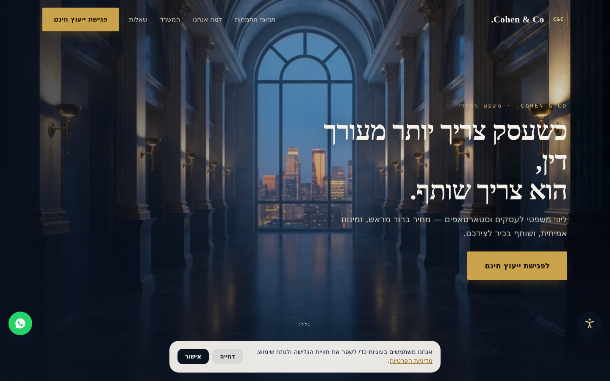
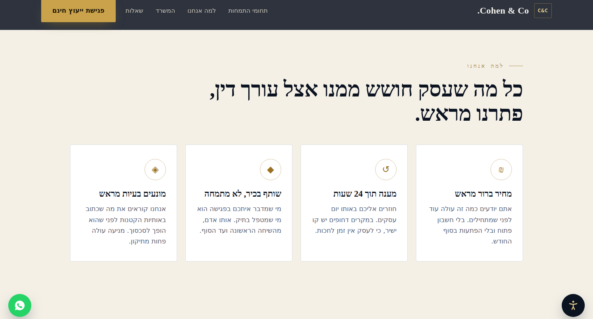
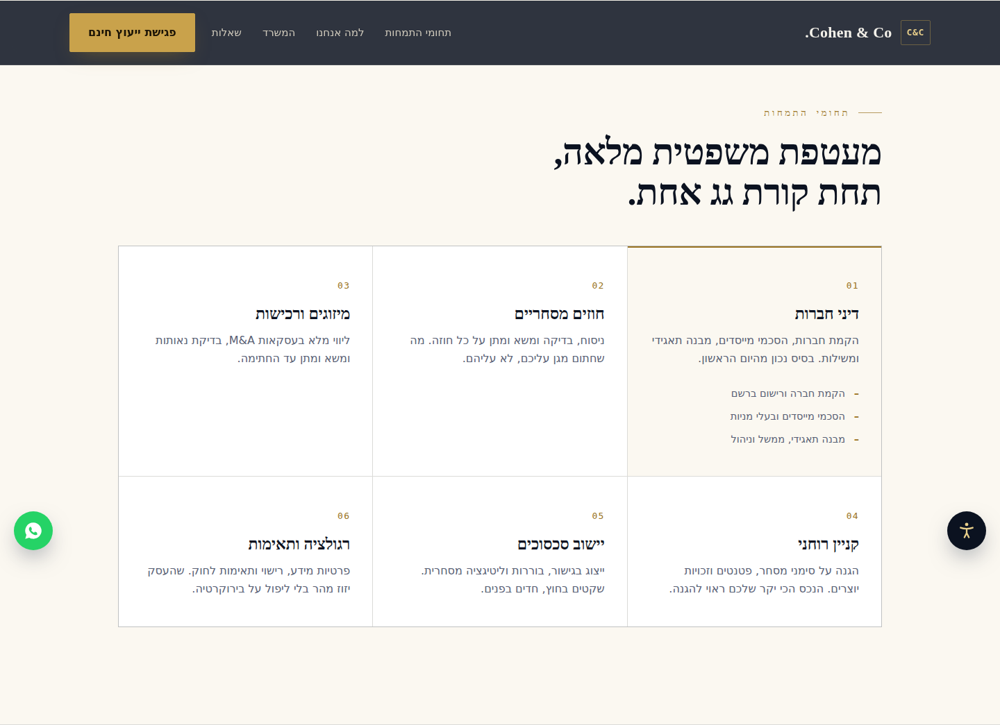
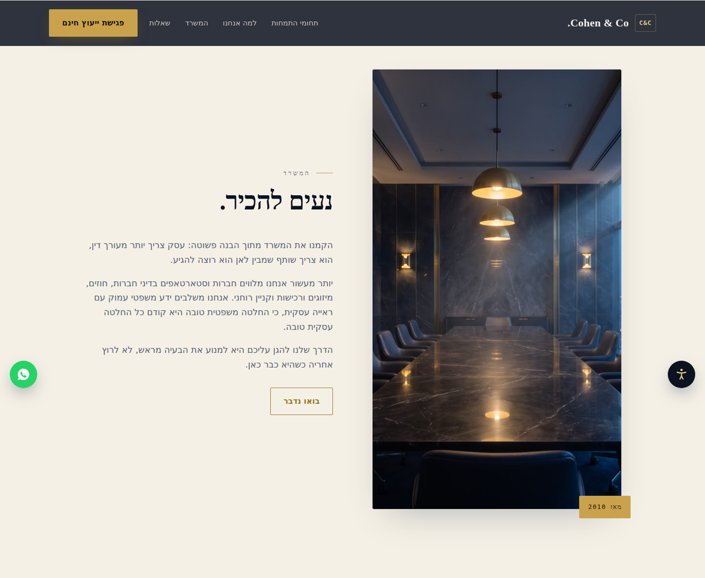
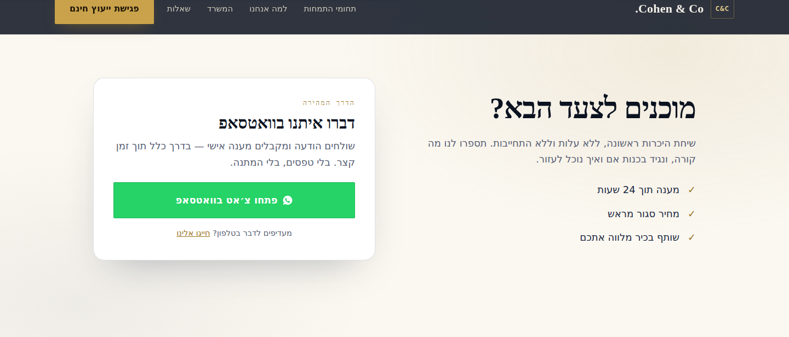
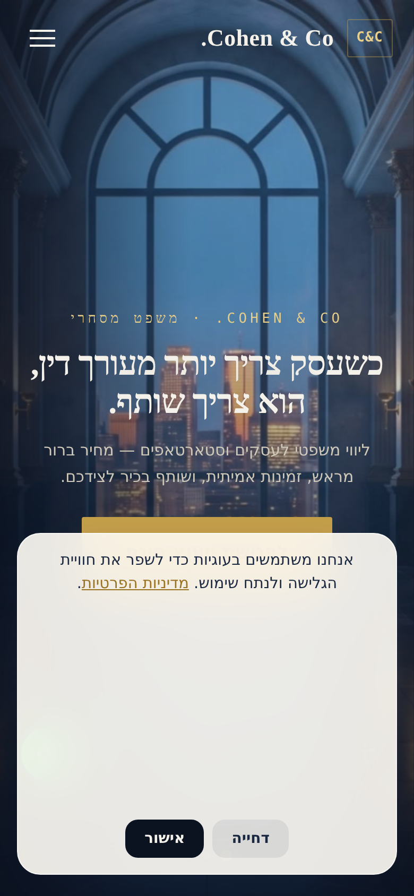
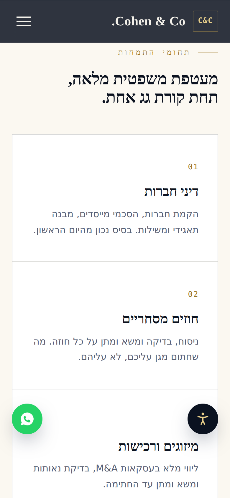

<div align="center">

# ⚖️ Hebrew Law Firm — Cinematic Landing Page Template

**A production-ready, fully responsive RTL / Hebrew landing page for a commercial law firm.**
Built with Next.js 15, Tailwind CSS, and Firebase — every word, color, and section driven from a single config file, so you can launch a customized site in minutes without touching component code.

<br />

[](https://nextjs.org/)
[](https://www.typescriptlang.org/)
[](https://tailwindcss.com/)
[](https://firebase.google.com/)


<br />

### 🔗 [**View the live demo →**](https://christmas-sale-landing.vercel.app/)

</div>

<br />

<div align="center">
  
  <br /><br />
  <em>A cinematic, scroll-driven opening with a full-bleed hero, floating WhatsApp & accessibility widgets, and a GDPR-style cookie banner.</em>
</div>

<br />

## ✨ Highlights

- 🎬 **Cinematic scroll experience** — a full-screen, scroll-driven showcase that cross-fades and gently zooms between scenes as the visitor scrolls.
- 🧩 **One-file customization** — every piece of copy, contact detail, theme color, and section lives in `src/config/site-config.ts`.
- 🌐 **Native RTL / Hebrew** — `lang="he" dir="rtl"`, Hebrew-subset fonts, and components styled right-to-left throughout.
- ♿ **Built-in accessibility widget** — font sizing, high contrast, readable font, highlight links, stop-motion, and more (Israeli Standard 5568 / WCAG 2.0 AA oriented).
- 💬 **WhatsApp-first contact** — a one-tap WhatsApp CTA, with an optional Firebase + EmailJS lead form also included.
- 🔒 **Security layer** — client-side CSP, form rate limiting, and violation tracking out of the box.

<br />

## 📸 Screenshots

<table>
  <tr>
    <td width="50%"></td>
    <td width="50%"></td>
  </tr>
  <tr>
    <td align="center"><sub><b>Why-us</b> — cards fade in one by one</sub></td>
    <td align="center"><sub><b>Services</b> — hover a card to reveal its detail points</sub></td>
  </tr>
  <tr>
    <td width="50%"></td>
    <td width="50%"></td>
  </tr>
  <tr>
    <td align="center"><sub><b>About</b> — firm story & credibility</sub></td>
    <td align="center"><sub><b>Contact</b> — WhatsApp-first call to action</sub></td>
  </tr>
</table>

<div align="center">
  <br />
  <b>📱 Mobile</b>
  <br /><br />
  
  &nbsp;&nbsp;
  
</div>

<br />

## 🚀 Quick Start

```bash
npm install                          # Install dependencies
cp .env.local.example .env.local     # Create your local env file
# ...then fill in your Firebase and EmailJS credentials in .env.local
npm run dev                          # Start the dev server at http://localhost:3000
```

<br />

## 🧰 Tech Stack

| Layer | Technology |
| --- | --- |
| **Framework** | Next.js 15 (App Router) |
| **Language** | TypeScript |
| **Styling** | Tailwind CSS 3 + `@tailwindcss/typography` |
| **Backend / data** | Firebase Firestore |
| **Email** | EmailJS |
| **Icons** | lucide-react |
| **Testing** | Vitest (unit) + Playwright (e2e) |

<br />

## 🎨 How to Customize

Almost all customization happens in **one file**: `src/config/site-config.ts`.

- **Content** — edit `site-config.ts` to change metadata/SEO, contact info, and all section content (hero, features, services, about, testimonials, footer). This single file controls the whole site; you rarely need to edit components.
- **Theme colors** — change the Tailwind classes in the `theme` block of `site-config.ts` (`primary`, `primaryHover`, `primaryLight`, `accent`).
- **Contact details** — update the `contact` block (phone, whatsapp, email, address). Also update the floating widget in `public/social-widget/social-widget.js`.
- **Legal pages** — edit the constants at the top of `app/privacy/PrivacyPolicyContent.tsx`, `app/terms/page.tsx`, and `app/accessibility/page.tsx`.
- **Icons** — icons render dynamically via `src/components/ui/Icon.tsx`. Add a new Lucide icon to the `iconMap` there to reference it by name from the config.
- **Firebase & EmailJS** — configured entirely through environment variables (see `.env.local.example`). No code changes required.

### Environment Variables

Copy `.env.local.example` to `.env.local` and fill in:

- `NEXT_PUBLIC_FIREBASE_*` — your Firebase project credentials (API key, auth domain, project ID, storage bucket, messaging sender ID, app ID, measurement ID).
- `NEXT_PUBLIC_USE_FIREBASE_EMULATOR` — optional, set to `true` to use the local Firestore emulator in development.
- `NEXT_PUBLIC_EMAILJS_SERVICE_ID`, `NEXT_PUBLIC_EMAILJS_TEMPLATE_ID`, `NEXT_PUBLIC_EMAILJS_PUBLIC_KEY` — your EmailJS credentials.

<br />

## 📜 Available Scripts

| Script | Description |
| --- | --- |
| `npm run dev` | Start the development server |
| `npm run build` | Production build |
| `npm run start` | Start the production server |
| `npm run lint` | Run ESLint |
| `npm run type-check` | TypeScript type checking (`tsc --noEmit`) |
| `npm run test` | Run unit tests (Vitest) |
| `npm run test:ui` | Vitest interactive UI |
| `npm run test:run` | Run unit tests once |
| `npm run test:coverage` | Unit tests with coverage |
| `npm run test:e2e` | Run Playwright end-to-end tests |
| `npm run test:e2e:ui` | Playwright UI mode |
| `npm run test:e2e:debug` | Playwright debug mode |
| `npm run test:e2e:headed` | Playwright headed mode |
| `npm run snyk-test` | Snyk security scan (high severity threshold) |
| `npm run snyk-monitor` | Snyk continuous monitoring |

<br />

## ▲ Deployment

The template is optimized for **Vercel**:

1. Push the repository to your Git provider.
2. Import the project into Vercel.
3. Add all `NEXT_PUBLIC_*` environment variables in the Vercel project settings.
4. Deploy — Vercel auto-detects Next.js and builds it for you.

> The site root (`/`) serves the cinematic landing page via a `beforeFiles` rewrite in `next.config.js`.

Any Node.js host that supports Next.js 15 will also work (`npm run build` then `npm run start`).

<br />

## 📦 Handoff & License

This template is sold as a customizable starter. After purchase it is yours to use and modify for your own or your client's projects. You are responsible for providing your own Firebase project and EmailJS account (see [`WHATS_INCLUDED.md`](WHATS_INCLUDED.md)). The legal pages (privacy, terms, accessibility) are provided as editable Hebrew boilerplate and should be reviewed by a qualified professional before going live.
